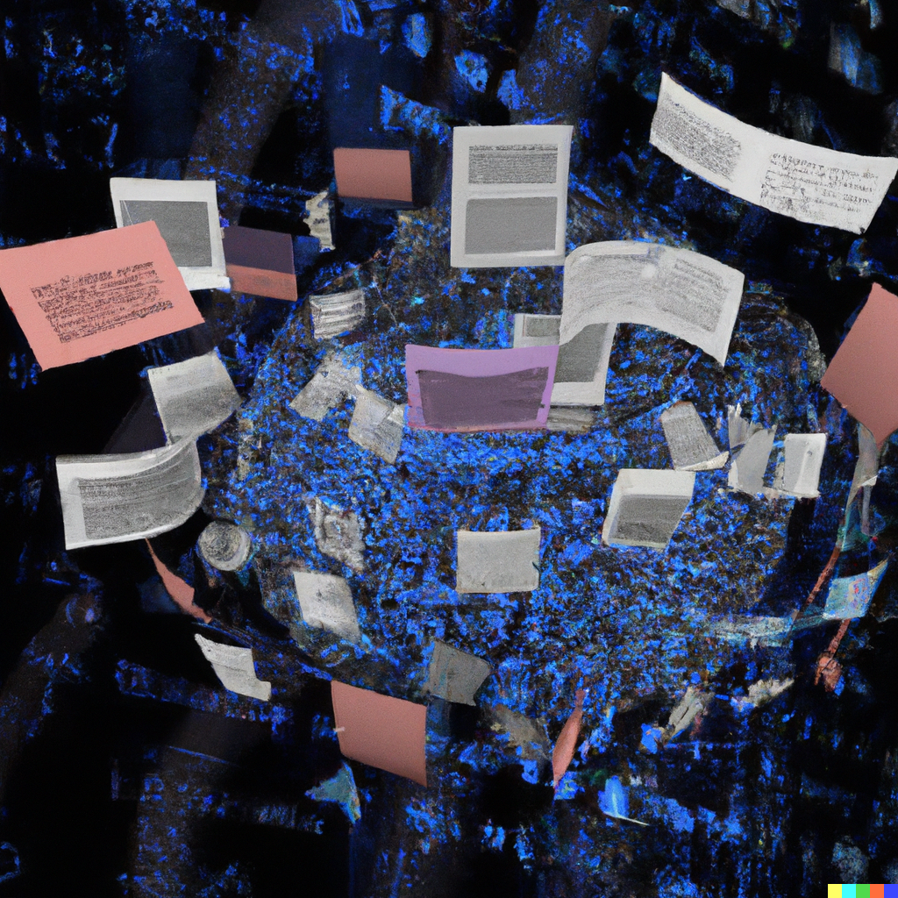

# Content Generation with LangChain

This project is an example of using langchain to generate various text outputs from a research paper pdf input.
This is just an example of using LangChain for reference.

## Overview

- Summarize the paper and pull out key insights
- Generate an "engaging" Twitter/X thread using the summarized text
- Create a prompt for OpenAI's DALL-E based on the text for your twitter thread

### Program Flow

Configure LLM -> Load PDF to chroma db -> Vectorstore Agent generates summary -> LLMChain generates twitter thread from summary -> LLMChain generates DALL-E prompt from summary

## Example Output

For this example the paper "Language Modeling Is Compression" from Google DeepMind was used as the input paper.
The paper can be found here [arxiv.org 2309.10668](2309.10668)

### Summary

```text
The paper titled "Language Modeling Is Compression" by Grégoire Delétang, Anian Ruoss, Paul-Ambroise Duquenne, Elliot Catt, Tim Genewein, Christopher Mattern, Jordi Grau-Moya, Li Kevin Wenliang, Matthew Aitchison, Laurent Orseau, Marcus Hutter, and Joel Veness, published by Google DeepMind, advocates for viewing the prediction problem through the lens of compression. The authors evaluate the compression capabilities of large language models and demonstrate that these models can be powerful general-purpose predictors. They provide insights into scaling laws, tokenization, and in-context learning. The authors also show that large language models can compress different types of data, such as ImageNet patches and LibriSpeech samples, to a smaller size compared to domain-specific compressors like PNG or FLAC. They explore the equivalence between prediction and compression, which allows compressors to be used as conditional generative models.
```

### Twitter Thread

```text
🧵 Exciting new research from @GoogleDeepMind! 📚🔬

📝 In their paper "Language Modeling Is Compression," Delétang et al. propose a fresh perspective on the prediction problem in AI through the lens of compression. Let's dive into the key findings! 🧐 #AI #Research

1️⃣ Language models are not just great at predicting text, they're also powerful general-purpose predictors! The authors demonstrate the impressive compression capabilities of large language models. 🗜️💡 #LanguageModeling #Compression

2️⃣ Scaling laws play a crucial role in understanding the potential of language models. Delétang et al. provide valuable insights into how these models scale with increasing size, shedding light on their predictive power. 📈🔍 #ScalingLaws #AI

3️⃣ Tokenization is a key aspect of language modeling, and the authors delve into its importance. They explore different tokenization strategies and their impact on compression, revealing fascinating nuances in the process. 🧩✂️ #Tokenization #Compression

4️⃣ In-context learning is another intriguing aspect explored in the paper. The authors show how language models can effectively learn from context, enhancing their compression capabilities and making them even more versatile. 📚🔀 #InContextLearning #AI

5️⃣ But it doesn't stop there! Delétang et al. go beyond text and demonstrate that large language models can compress various types of data, such as ImageNet patches and LibriSpeech samples. They outperform domain-specific compressors like PNG or FLAC! 🖼️🎙️ #DataCompression

6️⃣ The authors make a groundbreaking connection between prediction and compression. This equivalence allows compressors to be used as conditional generative models, opening up exciting possibilities for AI applications. 🔄🌌 #Prediction #GenerativeModels

🔬 This research pushes the boundaries of language modeling and highlights its potential beyond traditional text prediction. The compression perspective offers new insights and opportunities for AI development. Stay tuned for more! 🚀🔍 #AIResearch #Innovation

🔗 Read the full paper here: [insert link]

🙌 Kudos to the brilliant team at @GoogleDeepMind for their groundbreaking work! Let's continue exploring the fascinating world of AI together. 🤖💡 #AICommunity #DeepMind
```

### DALL-E Prompt

```text
Create an image that represents the groundbreaking research on language modeling and compression by Delétang et al. The image should showcase the versatility and power of large language models in predicting and compressing various types of data. It should depict a futuristic AI laboratory with language models at work, compressing and generating different forms of data such as text, images, and audio. The image should also highlight the connection between prediction and compression, symbolizing the exciting possibilities that arise from using compressors as conditional generative models.
```

#### Bing Image Creator Output Examples (DALL-E 3)

Examples images are manually generated from truncated prompt.


#### DALL-E 2 Output Examples 



